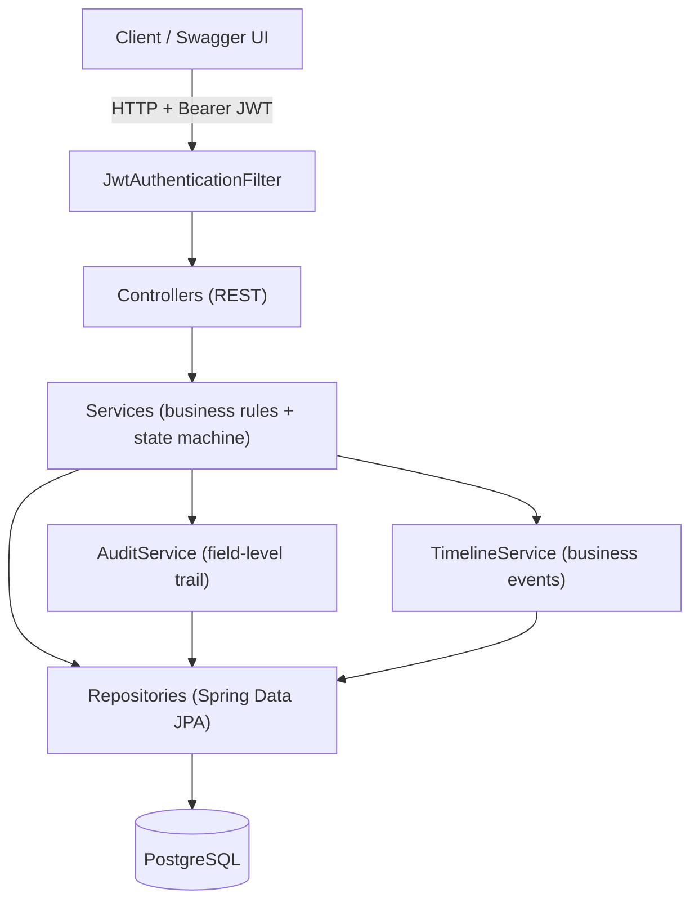
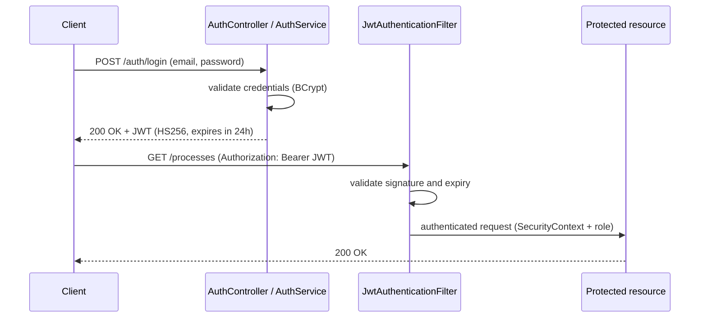

# GovProc

[](https://github.com/igorleite/govproc/actions/workflows/ci.yml)

🌐 [Leia em Português](README.md) | **English**

> A backend platform for managing government procurement processes — from capture to contract — built as a portfolio project demonstrating Domain-Driven Design, state machine patterns, and operational traceability with Java 21 and Spring Boot 3.

---

## Table of Contents

- [Overview](#overview)
- [Architecture](#architecture)
- [Authentication Flow (JWT)](#authentication-flow-jwt)
- [Process State Machine](#process-state-machine)
- [Tech Stack](#tech-stack)
- [Critical Domain Rules](#critical-domain-rules)
- [Module Status](#module-status)
- [Getting Started](#getting-started)
- [API Endpoints](#api-endpoints)
- [Technical Decisions](#technical-decisions)
- [Roadmap](#roadmap)
- [License](#license)

---

## Overview

GovProc models the complete lifecycle of a Brazilian public procurement process (_licitação_). The system tracks every state transition from the moment a bid is captured through analysis, quotation, dispute, and contract activation — with full audit trail and operational timeline.

**What this project demonstrates:**

- Domain state machines encapsulated inside entities (no public status setters)
- Hard separation between **cost** (Quotation) and **strategy** (Dispute)
- Dual traceability: `ProcessTimelineEvent` for operational events, `AuditLog` for field-level changes
- `BigDecimal` with `NUMERIC(19,4)` precision throughout — no `double` for money
- Modular monolith with 11 bounded-context packages, no unnecessary abstraction layers
- Each complex phase owns its **own status enum** (`AnalysisDecision`, `DisputeStatus`, `PostBidStatus`, `ContractStatus`) — the core `ProcessStatus` stays lean instead of absorbing every juridical sub-state

---

## Architecture

```
com.govproc
├── auth/           JWT authentication, roles (ADMIN, MANAGER, ANALYST, VIEWER)
├── process/        Core procurement entity + state machine + dashboard read model
├── analysis/       Operational viability analysis (1:1 per process)
├── quotation/      Supplier cost records — NO markup, NO margin
├── supplier/       Independent supplier registry
├── dispute/        Commercial strategy — margin, sale price, bid strategy
├── postbid/        Post-dispute phase — homologation, adjudication
├── contract/       Contract aggregate — lifecycle + commitments, invoices, addenda
├── timeline/       Immutable operational event log
├── audit/          Immutable field-level change log
└── shared/         BaseEntity, ApiResponse, exceptions, global handler
```

### Layered architecture



**Key structural choices:**
- Package-by-feature, not by layer
- No interface/implementation split without real contracts
- No `ApplicationEventPublisher` — service orchestration is explicit and readable
- `supplierId` stored as UUID in `Quotation` — no `@ManyToOne`, no cascade risk

---

## Authentication Flow (JWT)

Stateless authentication: login returns a JWT (HS256, 24h) validated by a filter on every protected request. No server-side session.



Roles (`Role`): `ADMIN`, `MANAGER`, `ANALYST`, `VIEWER`. Public registration always creates an `ANALYST`; `/auth/**` and Swagger are open, everything else requires a token.

---

## Process State Machine

Every state transition is a domain method on `ProcurementProcess` with internal validation. No public status setter exists.

```
CAPTURED
   │
   └──[startAnalysis()]──► UNDER_ANALYSIS
                                │
              ┌─────────────────┴─────────────────┐
              │                                   │
   [approveAnalysis()]                  [rejectAnalysis(reason)]
              │                                   │
       ANALYSIS_APPROVED               ANALYSIS_REJECTED
              │
   [startQuotation()]
              │
         IN_QUOTATION
              │
   [markAsQuoted()]  ← requires selected quotation
              │
           QUOTED
              │
   [startDispute()]
              │
          IN_DISPUTE
              │
       ┌──────┴──────┐
       │             │
  [markAsWinner()] [markAsLoser()]
       │             │
    WINNER         LOSER
       │
   [startPostBid()]
       │
     POST_BID   ← post-dispute phase (PostBid: PENDING→HOMOLOGATED→ADJUDICATED→COMPLETED)
       │
   [activateContract()]  ← requires PostBid COMPLETED
       │
  CONTRACT_ACTIVE   ← contract phase (Contract: ACTIVE→CLOSED/EXPIRED/TERMINATED)
       │
   [close()]
       │
    CLOSED
```

> **Note the deliberate restraint:** homologation and adjudication are *not* process states — they live inside the `PostBid` bounded context (`PostBidStatus`). The process only knows it is in `POST_BID`. Same for the contract lifecycle (`ContractStatus`). This keeps `ProcessStatus` at 11 values instead of letting it grow unbounded with every juridical step.

---

## Tech Stack

| Layer | Technology |
|---|---|
| Language | Java 21 |
| Framework | Spring Boot 3.3.5 |
| Security | Spring Security + JWT (jjwt 0.12.6) |
| Persistence | Spring Data JPA + Hibernate |
| Database | PostgreSQL 16 |
| Migrations | Flyway |
| Validation | Jakarta Bean Validation |
| Documentation | SpringDoc OpenAPI 3 / Swagger UI |
| Testing | JUnit 5 + Mockito (unit) · Testcontainers (integration) |
| Coverage | JaCoCo |
| Build | Maven |
| Container | Docker + Docker Compose |
| CI/CD | GitHub Actions |

---

## Critical Domain Rules

### 1. Cost ≠ Strategy

`Quotation` represents **cost only**. It contains:
- Supplier, manufacturer, brand
- Unit cost, shipping cost, total cost
- Technical notes, delivery days, quantity

It does **NOT** contain markup, margin, pricing strategy, or bid aggressiveness. Those belong to **Dispute** — a completely separate bounded context.

This is a deliberate, non-negotiable domain decision.

### 2. `selected` is not a delete

Multiple quotations can exist per process. When one is selected (`selected = true`), the others are **deselected, not deleted**. Full quotation history is preserved for compliance and operational traceability.

### 3. `BigDecimal` always

All monetary values use `BigDecimal` with `NUMERIC(19,4)` precision. `double` and `float` are forbidden for money, cost, margin, or price.

### 4. No Cascade ALL on Supplier

`Supplier` has its own lifecycle. `Quotation.supplierId` is stored as a plain `UUID` — no `@ManyToOne`, no cascade. A supplier must not be deleted because a quotation was removed.

### 5. Budget commitment consumes balance — invoice does not

In a public contract these are distinct moments. A **commitment** (_empenho_) reserves budget and **reduces** `remainingBalance` — even before any payment. An **invoice** (_fatura/liquidação_) confirms delivery; it answers *"did the supplier deliver?"*, not *"how much can I still commit?"* — so it does **not** touch the balance. An **addendum** (_aditivo_) changes the contract's capacity (`contractValue` + `remainingBalance` for value types, `endDate` for term types). These invariants live on the `Contract` aggregate root.

---

## Module Status

| Module | Status | Migrations | Tests |
|---|---|---|---|
| `shared/` | ✅ Complete | — | — |
| `auth/` | ✅ Complete | V1 | 6 |
| `process/` | ✅ Complete | V2 | 5 |
| `timeline/` | ✅ Complete | V3 | — |
| `analysis/` | ✅ Complete | V4 | 6 |
| `audit/` | ✅ Complete | V5 | — |
| `supplier/` | ✅ Complete | V6 | 2 |
| `quotation/` | ✅ Complete | V7 | 5 |
| `dispute/` | ✅ Complete | V8 | 9 |
| `postbid/` | ✅ Complete | V9 | 8 |
| `contract/` | ✅ Complete | V10, V11 | 16 |

> The `process/` tests are the dashboard read-model (CQRS-lite); the core state machine is exercised through every other module's workflow tests.

**Totals:** 118 classes · 60 tests (57 unit + 3 integration) · 11 Flyway migrations

Integration tests (`GovProcIntegrationTest`) run the full Spring Boot context against a real PostgreSQL via **Testcontainers** — proving the 11 Flyway migrations apply, the JPA mapping validates (`ddl-auto=validate`), the JWT chain works end-to-end, and DB constraints (e.g. `uq_process_number_uasg`) surface correctly.

**Coverage (JaCoCo)** — report generated at `target/site/jacoco/` on every `./mvnw test`:

| Layer | Coverage (line) |
|---|---|
| Services | **88%** |
| Domain | **91%** |
| Overall | **85%** |

Business logic lives in services and domain — where coverage is high. Controllers are thin delegators (receive, validate, call the service), exercised indirectly by the integration tests; artificial controller coverage is deliberately not pursued.

---

## Getting Started

### Prerequisites

- Java 21
- Docker + Docker Compose
- Maven (or use the included wrapper)

### 1. Start the database

```bash
docker compose up -d
```

### 2. Run the application

```bash
./mvnw spring-boot:run
```

On Windows:
```bash
.\mvnw.cmd spring-boot:run
```

> If `JAVA_HOME` is not configured globally, set it before running:
> ```powershell
> $env:JAVA_HOME = "C:\path\to\jdk-21"
> ```

### 3. Access the API

| URL | Description |
|---|---|
| `http://localhost:8080/swagger-ui.html` | Interactive API documentation |
| `http://localhost:8080/v3/api-docs` | Raw OpenAPI spec |

### 4. Authenticate

```bash
# Register
POST /auth/register
{
  "name": "Igor Andrade",
  "email": "igor@govproc.dev",
  "password": "password123"
}

# Login — returns JWT token
POST /auth/login
{
  "email": "igor@govproc.dev",
  "password": "password123"
}
```

Use the returned token as `Authorization: Bearer <token>` in all subsequent requests.

---

## API Endpoints

### Auth
| Method | Path | Description |
|---|---|---|
| `POST` | `/auth/register` | Register new user (role: ANALYST) |
| `POST` | `/auth/login` | Authenticate and receive JWT |

### Processes
| Method | Path | Description |
|---|---|---|
| `POST` | `/processes` | Capture new procurement process |
| `GET` | `/processes` | List all processes |
| `GET` | `/processes/{id}` | Get process by ID |
| `GET` | `/processes/{id}/timeline` | Operational event history |
| `GET` | `/processes/{id}/audit` | Field-level change log |

### Dashboard (read-only / CQRS-lite)
| Method | Path | Description |
|---|---|---|
| `GET` | `/dashboard/summary` | Pipeline counts + active contracts |
| `GET` | `/dashboard/financial` | Quoted cost, expected profit, contract value, remaining balance |
| `GET` | `/dashboard/performance` | Win rate, loss rate, average expected profit |

### Analysis
| Method | Path | Description |
|---|---|---|
| `POST` | `/processes/{id}/analysis/start` | Start analysis → `UNDER_ANALYSIS` |
| `POST` | `/processes/{id}/analysis/approve` | Approve → `ANALYSIS_APPROVED` |
| `POST` | `/processes/{id}/analysis/reject` | Reject → `ANALYSIS_REJECTED` |
| `GET` | `/processes/{id}/analysis` | Get analysis record |

### Quotation
| Method | Path | Description |
|---|---|---|
| `POST` | `/processes/{id}/quotation/start` | Start quotation phase → `IN_QUOTATION` |
| `POST` | `/processes/{id}/quotations` | Add supplier cost quotation |
| `GET` | `/processes/{id}/quotations` | List all quotations (ordered by total cost) |
| `PUT` | `/processes/{id}/quotations/{qid}/select` | Select winning quotation |
| `POST` | `/processes/{id}/quotation/mark-quoted` | Mark as quoted → `QUOTED` |

### Suppliers
| Method | Path | Description |
|---|---|---|
| `POST` | `/suppliers` | Register supplier |
| `GET` | `/suppliers` | List active suppliers |
| `GET` | `/suppliers/{id}` | Get supplier by ID |
| `DELETE` | `/suppliers/{id}` | Deactivate supplier (logical delete) |

### Dispute
| Method | Path | Description |
|---|---|---|
| `POST` | `/processes/{id}/dispute/start` | Start dispute → `IN_DISPUTE` (snapshots quoted cost) |
| `PUT` | `/processes/{id}/dispute` | Revise commercial strategy (field-level audit) |
| `POST` | `/processes/{id}/dispute/winner` | Mark as winner → `WINNER` |
| `POST` | `/processes/{id}/dispute/loser` | Mark as loser → `LOSER` |
| `GET` | `/processes/{id}/dispute` | Get dispute record |

### PostBid
| Method | Path | Description |
|---|---|---|
| `POST` | `/processes/{id}/post-bid/start` | Start post-dispute phase → `POST_BID` |
| `POST` | `/processes/{id}/post-bid/homologate` | Homologate → `HOMOLOGATED` |
| `POST` | `/processes/{id}/post-bid/adjudicate` | Adjudicate → `ADJUDICATED` |
| `POST` | `/processes/{id}/post-bid/complete` | Complete → `COMPLETED` |
| `GET` | `/processes/{id}/post-bid` | Get post-bid record |

### Contract
| Method | Path | Description |
|---|---|---|
| `POST` | `/processes/{id}/contract/activate` | Activate contract → `CONTRACT_ACTIVE` (requires PostBid COMPLETED) |
| `POST` | `/processes/{id}/contract/close` | Close contract & process → `CLOSED` |
| `POST` | `/processes/{id}/contract/terminate` | Terminate (early) → contract `TERMINATED`, process `CLOSED` |
| `POST` | `/processes/{id}/contract/expire` | Expire → contract `EXPIRED`, process `CLOSED` |
| `GET` | `/processes/{id}/contract` | Get contract record |

### Contract Execution (aggregate members)
| Method | Path | Description |
|---|---|---|
| `POST` | `/processes/{id}/contract/commitments` | Register commitment (_empenho_) — **reduces balance** |
| `GET` | `/processes/{id}/contract/commitments` | List commitments |
| `POST` | `/processes/{id}/contract/invoices` | Register invoice (_fatura_) — does **not** touch balance |
| `GET` | `/processes/{id}/contract/invoices` | List invoices |
| `POST` | `/processes/{id}/contract/addenda` | Apply addendum (_aditivo_) — value or term change |
| `GET` | `/processes/{id}/contract/addenda` | List addenda |

---

## Technical Decisions

### No interface/implementation split
`ProcessService`, not `ProcessService` + `ProcessServiceImpl`. Classes are concrete. Mockito mocks concrete classes.

### No ApplicationEventPublisher
Timeline and audit calls are explicit in every service method. The tradeoff is verbosity for 100% visible control flow — no "magic" wiring.

### AuditLog does not extend BaseEntity
`AuditLog` is an immutable compliance record. It has its own `performedAt: Instant` set in the constructor. Using `@LastModifiedDate` on a log entry would be semantically wrong.

### `totalCost` computed and persisted
`totalCost = unitCost × quantity + shippingCost`, normalized to scale 4, stored in the database. If the formula changes in the future, historical records remain accurate.

### Atomic quotation selection
`selectQuotation()` calls `clearSelectedByProcess(processId)` via `@Modifying @Query` before calling `quotation.select()`. This ensures exactly one `selected = true` per process with no inconsistency window.

### Sub-statuses stay out of `ProcessStatus`
Homologation, adjudication and the contract lifecycle are *not* process states. They are encapsulated in their own enums (`PostBidStatus`, `ContractStatus`) inside their bounded contexts. The core machine only knows `POST_BID` and `CONTRACT_ACTIVE`. This is the same reasoning that keeps `DisputeStatus` (OPEN/CONCLUDED) out of the process — and it prevents `ProcessStatus` from growing unbounded.

### Contract activation guard lives in the service
`activateContract()` (the domain method) only validates `POST_BID → CONTRACT_ACTIVE`. The rule *"only when the post-dispute phase is COMPLETED"* lives in `ContractService`, because the process does not — and should not — know about `PostBid`. Cross-context invariants belong to the application layer, not the entity.

---

## Roadmap

- [x] **Dispute module** — margin, sale price, bid strategy (these belong here, not in Quotation)
- [x] **PostBid module** — homologation, adjudication, completion
- [x] **Contract module** — contract number, validity, value, balance, own lifecycle
- [x] **Contract aggregate deepening** — commitments (balance consumption), invoices, addenda (value/term changes)
- [x] **Dashboard / KPIs** — read model (CQRS-lite) with summary, financial and performance aggregations
- [x] **Integration tests with Testcontainers** — real PostgreSQL, Flyway, JWT chain, DB constraints
- [x] **CI pipeline (GitHub Actions)** — build + full test suite on every push/PR
- [ ] Payments & measurements (deliberately out of scope — avoids turning GovProc into a financial ERP)
- [ ] Supplier name/document snapshot on Quotation (for immutable historical accuracy)
- [ ] Partial unique index `WHERE selected = true` at the database level
- [ ] Role promotion endpoint (ANALYST → MANAGER → ADMIN)

---

## License

MIT License — Copyright (c) 2026 [Igor Leite de Andrade](https://github.com/igorleite)
